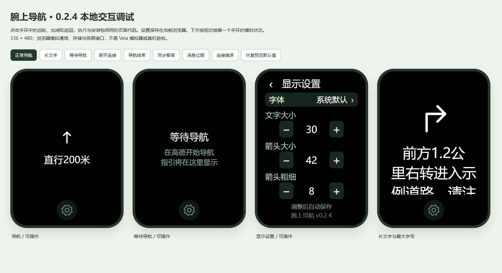

# 腕上导航 · 小米手环 9 Pro

把 Android 高德地图的导航通知同步到小米手环 9 Pro，在手腕上查看转向和完整指引。

> 本项目仅供学习、研究与技术交流。此说明表达项目定位，不额外限制 [MIT 许可证](LICENSE) 授予的权利；第三方组件遵循各自许可。

个人开发的实验性项目，与高德、小米或 AstroBox 无隶属关系。当前配套版本：**手机 0.2.1 / 手环 0.2.4**，首次公开作为测试版提供。

[下载安装包](https://github.com/Gu-Mie/mi9pro-gaode/releases) · [首次使用](docs/getting-started.md) · [开发指南](docs/development.md) · [更新记录](CHANGELOG.md) · [隐私说明](PRIVACY.md)



上图使用虚构数据，是当前源码的浏览器预览，并非真机截图。

## 功能

- 查看转向箭头与完整高德通知，长内容可滚动；保留无法识别的原文，不计算或编造路线。
- 高德开始导航时请求打开手环页面，按一次导航控制，减少重复抢回前台。
- 导航页在前台、指引有效时可保持亮屏；结束、断连、过期或离开页面后释放，手机端可关闭此功能。
- 手环可选择系统默认、宋体、楷体、圆体，调整字号、箭头大小和粗细，自动保存并支持恢复默认。
- 手机端提供同步开关、连接授权与后台运行设置。

## 下载与安装

从 [GitHub Releases](https://github.com/Gu-Mie/mi9pro-gaode/releases) 获取同一次发布的配套文件：

| 文件 | 用途 |
| --- | --- |
| `NAV-PHONE-021.apk` | 安装到 Android 手机 |
| `NAV-BAND-024.rpk` | 通过 AstroBox「快应用」安装到小米手环 9 Pro |
| `SHA256SUMS.txt` | 下载文件完整性校验 |
| `THIRD_PARTY_NOTICES.txt` | 第三方组件及字体许可说明 |

安装后恢复小米运动健康连接，打开手机腕上导航，授予通知使用权、设备权限及互联授权，开启同步，再在高德开始导航。详细步骤见 [首次使用](docs/getting-started.md)。更新会保留旧设置，可在手环设置底部点「恢复默认」应用字号 30、箭头 42、粗细 8 的比例。

## 适用范围与测试状态

- 手机最低 Android 8.0（API 26），需要高德地图及小米运动健康；实际联调手机为小米 15，其他手机兼容性待验证。
- 手环按小米手环 9 Pro 的 336 × 480 屏幕适配，其他穿戴设备未验证。
- 需要手机保持导航与连接，不支持独立定位、路线规划或脱离手机导航。常亮仅用于导航页前台，不是系统 AOD。
- 用户于 2026-09-22 确认手环 0.2.4 安装使用正常；字体实际加载、所有显示设置、长时间锁屏、重启恢复、ACK 回程及耗电尚未逐项验收。
- 手机 APK 为原有已签名调试构建。安装包已核对匹配签名及 SHA-256，本地检查不能替代真机验收，见 [验证摘要](docs/navigation-verification.md)。

## 本地开发

安装 Node.js 22+（推荐 24），在项目根目录运行：

```sh
npm test
npm run dev
```

根目录无需安装 npm 依赖，也无需手机、手环、签名或 Android SDK。打开 <http://127.0.0.1:4173/> 操作实际源码生成的交互预览；原生接口由浏览器模拟。`/settings` 保留独立设置原型。预览输出到本地 `outputs/previews/`。完整构建步骤见 [开发指南](docs/development.md)。

```text
android/       Android 手机应用及单元测试
wearable/      Vela 手环应用、字体、图标及测试
tools/         开发、预览、构建检查与验证工具
docs/          安装、开发、实现与验证文档
licenses/      第三方许可文本
.github/       CI、Issue 与 PR 模板
```

`outputs/`、`.local/`、签名、SDK AAR 和依赖缓存不进入源码仓库。文件公开范围与维护方法见 [发布说明](docs/open-source-release.md)。

## 反馈与许可

欢迎提交 [Issue](https://github.com/Gu-Mie/mi9pro-gaode/issues) 或小范围 PR，先阅读 [贡献指南](CONTRIBUTING.md)。联系邮箱：[2858005527@qq.com](mailto:2858005527@qq.com)。安全问题请按 [安全说明](SECURITY.md) 私下反馈。

原创代码与文档采用 [MIT](LICENSE)。字体适用 SIL OFL 1.1，Gradle Wrapper 保留 Apache-2.0，小米 XMS SDK 不属于本项目 MIT 授权范围，详见 [第三方声明](THIRD_PARTY_NOTICES.md)。
